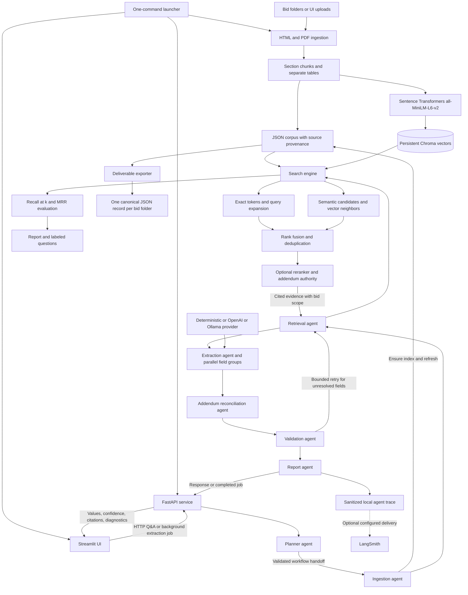

# Architecture

## Communication

The UI calls the API over loopback HTTP. Extraction runs in an API-managed background
job, and the UI polls for its validated response. Standalone synchronous endpoints remain
available. The launcher owns only its two child processes and forwards the actual API URL
and indexed bid IDs to Streamlit.

Agents execute as LangGraph nodes in one process, not independent network services.
Pydantic handoff messages identify sender, recipient, run, task, payload type, state version,
and retry context. Retrieval tool calls carry bid/document filters. Evidence preserves file,
page or HTML locator, text, authority status, and addendum identity across every boundary.

The canonical twenty-field extractor is reused by CLI/API export. Per-item citations and
confidence accompany collection values. Validation can request bounded additional retrieval;
missing facts remain null/not found, and unresolved conflicts remain review-required.

## Persistence And Limits

- Normalized reports: `output/<folder>/processing-report.json`.
- Corpus: `output/search-index.json`; active vector collection: `output/chroma`.
- Runtime trace path is configurable; exported examples live under `output/sample-outputs`.
- API extraction jobs are process-local and disappear on restart; they are not a durable queue.
- Optional remote model providers receive evidence text. Deterministic exports need no model credentials.
- Image-only source pages are diagnosed, not OCR-transcribed. Confidence is heuristic.
- Two legacy evaluation questions depend on removed headings and are audited as excluded, not scored as successes.